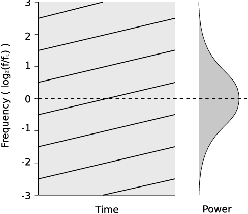
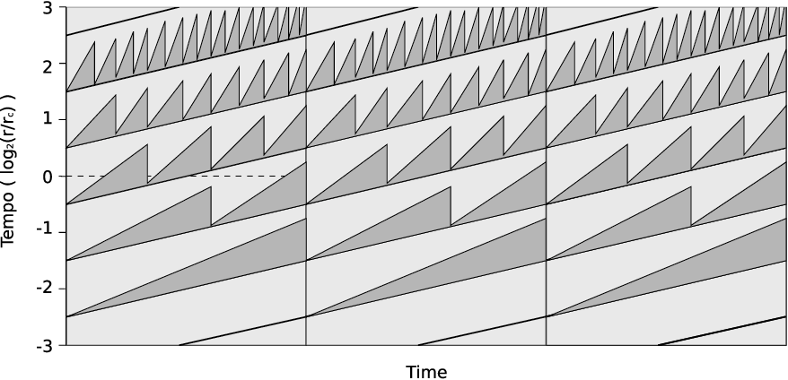

# risset-rhythm-effect

This is a version of the endlessly speeding drumloop, also known as the Risset Rhythm Effect. This effect is created and demonstrated by Jean-Claude Risset, a french composer who also created the Shepard-Risset Glissando.

# About

The patch plays 5 voices of the same drumloop. All 5 voices gradually increase in playback speed (and therefore also shift in pitch). The end-speed of voice 1 is the start-speed of voice 2, the end-speed of voice 2 is the start-speed of voice 3, etcetera. 

The voices have a part of a gain curve applied to them (the complete curve is a cosine). This assures that the first voice fades in and ends at the amplitude the second voice starts with. The second voice ends with the amplitude the third voice starts with. The third voice is decreasing in amplitude half-way through and therefore ends at the amplitude the fourth voice starts with, the fifth voice completely fades out to 0.

# Further Reading

[Dan Stowel - Scheduling and Composing with Risset Eternal Accelerando Rhythms](https://pdfs.semanticscholar.org/2de1/e9505baf81121d1622e0470d09cc48577f3a.pdf?_ga=2.215081439.912473153.1595938513-10364231.1595938513)

# Images

[*Diagrammatic representation of a Risset accelerando. from Dan Stowel paper*](https://pdfs.semanticscholar.org/2de1/e9505baf81121d1622e0470d09cc48577f3a.pdf?_ga=2.215081439.912473153.1595938513-10364231.1595938513)

[*Diagrammatic representation of a Risset accelerando. from Dan Stowel paper*](https://pdfs.semanticscholar.org/2de1/e9505baf81121d1622e0470d09cc48577f3a.pdf?_ga=2.215081439.912473153.1595938513-10364231.1595938513)
